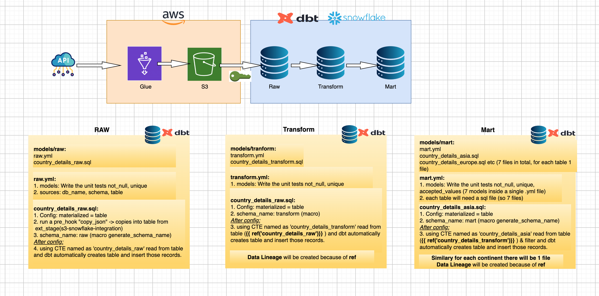
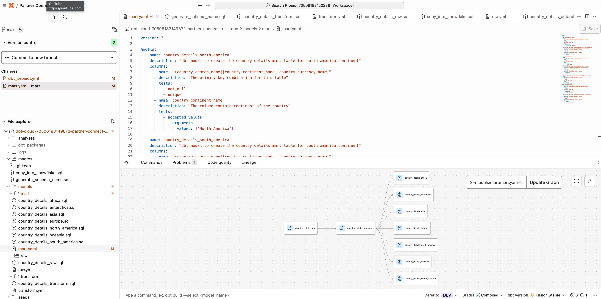

# Glue-DBT
End-to-end data engineering POC that loads semi-structured JSON from an API into AWS S3, transforms it in Snowflake with dbt, and supports modular models, data quality tests, lineage, and GitHub-based CI/CD.  
